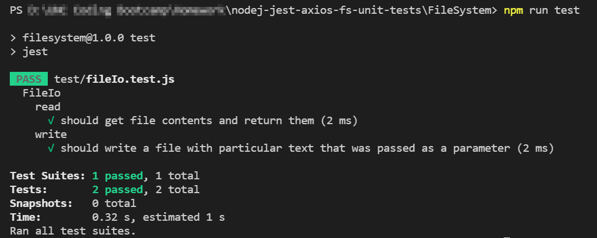

# Jest Unit Tests for Node App Setup

This is a template to setup unit tests using the [Jest!] (https://jestjs.io/) framework for an API call (using [Axios!] (https://axios-http.com/) and a file system call for [Node.js!] (https://nodejs.org/en/). To run this you will need to clone down the repo and then run `npm install` in each folder (Api, FileSystem) and then it can be run with `npm run test` (notice line 6-7 of package.json).

# Screenshot

